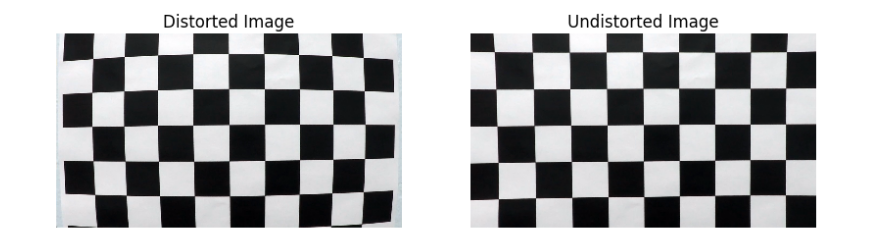
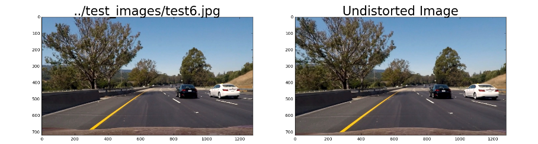
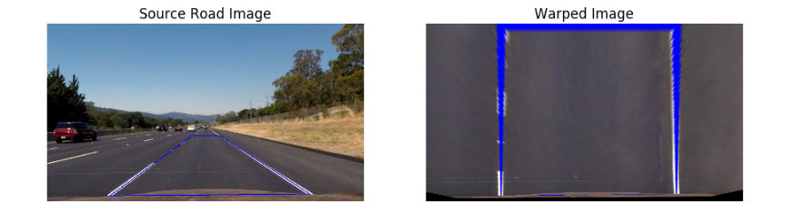
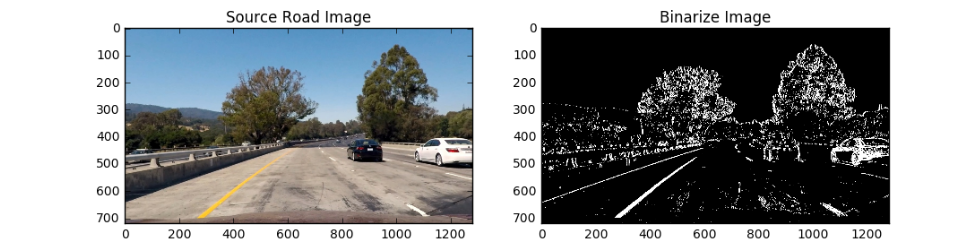

# Self-Driving Car Engineer Nanodegree
## Computer Vision: Advanced Lane Finding

### Overview

The objective of this project is to identify lane lines using traditional computer vision techniques.
In order to achieve this, the designed computer vision pipeline is as below. 

Camera calibration and undistortion

Wrap Transformation.

Image Binarize

Lane line extraction

Calculating road left and right lane curvature

Producing output images and videos with highlighted lane lines.

The input of pipeline would be images or video clips. 
Input images or videos will go through various pipeline stages and produce annotated video and images as given below.

Image 
------------


Following here i am  describing my pipeline stages starting from the Camera Calibration. The sample input and output of the Camera Calibration pipeline stage is given below.

### Camera Calibration
The calibration is performed using chessboard pattern images taken using the same camera as the project videos

The chessboard pattern calibration images (in the cal_images folder) contain 9 and 6 corners in the horizontal and vertical directions, respectively (as shown above). 
First, a list of "object points", which are the (x, y, z) coordinates of these chessboard corners in the real-world in 3D space, is compiled.
The chessboard is assumed to be in the plane z=0, with the top-left corner at the origin

Camera calibration logic is encapsulated in **`CameraCalibrate`** class in the **`adv_lane_lines.py`** module. This class's constructor takes following arguments.

1. A list of camera images which we are going to use for camera calibration. 
2. Number of corners in X direction (rows)
3. Number of corners in Y direction (Col)

The public method of this **`CameraCalibrate`** class is **`undistort`** and it takes a distorted image as the input and produces an undistorted image.

<p align="center">
 
</p>

Following image shows before and after applying distortion correction to a typical road image.

<p align="center">
 
</p>

### Warp Transform

The second step of the lane line finding pipeline is "perspective transformation" step.
An image perspective is a phenomenon where objects appear smaller the further away they are from a viewpoint.   

A perspective transform maps the points in a given image to different, desired, image points with a new perspective.
In the project we are going to use bird’s-eye view transform that allows us to view a lane from above; this will be useful for
calculating the lane curvature.

Warped operation is encapsulated in **`Transformation`** class of the **`adv_lane_lines.py`** package located in **`src`** folder. 
In order to create an instance of **`Transformation`**  class, we need to provide four source and destination points.
In order to clearly visible lane lines, we have selected following source and destination points. 

|Source Points | Destination Points|
|--------------|-------------------|
|(253, 697)    |   (303, 697)      |
|(585, 456)    |   (303, 0)        |
|(700, 456)    |   (1011, 0)       |
|(1061, 690)   |   (1011, 690)     |


I verified the performance of my perspective transformation by transforming an image (**`../output_images/undistorted_test_images/straight_lines2.jpg`**) using above source and destination points as given below.

<p align="center">
 
</p>

### Image Binarize

Correctly identifying lane line pixels is one of the main tasks of this project. 
In order to identify lane line, we have used three main techniques namely:

1. Sobel operation in X direction

	Sobel operator is a discrete differential operator. The operator utilizes two 3x3 kernels.
    
    Sobel operator’s smoothing effect (Gaussian smoothing), it is less sensitive to noise present in images.
    
2. Color thresholding in S component of the HLS color space.
3. Color thresholding in L component of the HLS color space.
 
These three operations are encapsulated in the method called **`image_binarize`** in **`adv_lane_lines.py`** module located in **`src`** folder.

Also, below shows the `image_binarize` operation applied to a sample image.

<p align="center">
 
</p>

### Lane Line Extractor

Now we have extracted lane line pixels. So next step would be calculating the road curvature and other necessary quantities (such as how much the vehicle off from the center of the lane)

In order to calculate road curvature, we have used two methods as given below.

1. **`basic_lane_finder(self, binary_warped)`** (inside the **LaneLine** class in advanced_line_finding module)
2. **`advance_lane_finder(self, binary_warped)`** (inside the **LaneLine** class in advanced_line_finding module

Both methods take a binary warped image (similar to one shown above) and produce X coordinates of both left and right lane lines. `basic_lane_finder(self, binary_warped)` method uses **sliding window** to identify lane lines from the binary warped image and then uses a second order polynomial estimation technique to calculate road curvature.

The output of lane line extractor algorithm is visualize in following figure.

<p align="center">
 
</p>

When it comes to video processing we start (with the very first image in the video) with **``basic_lane_finder(self, binary_warped``** method.
Once we have identified lane lines we moves to the **``advance_lane_finder(self, binary_warped)``** which doesn't blindly search entire image but 
uses lane lines identify in the previous image in the video.

### Lane Line Curvature Calculator

We have created a utility mehtod called **``(self, image_size, left_x, right_x)``** inside of the **``LaneLine``** class. It takes  size of the image (**``image_size``**), left lane line pixels (**``left_x``**) and right lane line pixels (**``right_x``**) as arguments returns following information.

1. **``left_curverad``** : Curvature of the left road line in meters.
2. **``right_curverad``** : Curvature of the right road line in meters.
3. **``lane_deviation``** : Deviation of the vehicle from the center of the line in meters.

### Highlighted Lane Line and Lane Line Information

In order to easy work with images as well as videos, we have created a Python class called **`Line`** inside the **`advanced_lane_finding`** module. It encapsulates all the methods we described above and few more helper methods as well.  

The key method of **`LaneLine`** class is **`processpipe(self, image)`** method. It takes a single image as the input. That image goes through the image process pipeline as described above and finally produces another image which contains highlighted lane line, lane line curvature information and the content of the original image.

The following section shows how we can use it with road images and videos.

```python
src_image = mpimg.imread('../test_images/test5.jpg')

line = advanced_lane_finding.Line()
output_image = line.process(src_image)

plt.figure(figsize=(10, 4))
plt.axis('off')
plt.imshow(output_image)
plt.show()
```
<p align="center">
 
</p>

```python
output_file = '../processed_project_video.mp4'
input_file = '../project_video.mp4'
line = advanced_lane_finding.Line()

clip = VideoFileClip(input_file)
out_clip = clip.fl_image(line.process) 
out_clip.write_videofile(output_file, audio=False)
```

<p align="center">
    <a href="https://youtu.be/9ciherslC9M">
        
    </a>
</p>

### Conclusions and Future Directions

This project took relatively a large amount of time when it compares to other (deep learning) projects. 
The hyper-parameter tuning process in my computer vision pipeline was tedious and time-consuming.
Unfortunately, my pipeline didn't generalize across diffrent road conditions.

It did ran for the challange video a bit ok , but then it couldnt complete the ride fully. I need to work further on enhancing my pipeline.

When it comes to extensions and future directions, I would like to highlight followings.

I feel that i need imporve on my computer vision techniques. I think this project help me understand a bit more. After I failed to see that the challegne 
video failed I did refer to lot of papers as below, which i would like to futher work on. 

[1] Juneja, M., & Sandhu, P. S. (2009). Performance evaluation of edge detection techniques for images in spatial domain. International Journal of Computer Theory and Engineering, 1(5), 614.

[2] Yoo, H., Yang, U., & Sohn, K. (2013). Gradient-enhancing conversion for illumination-robust lane detection. IEEE Transactions on Intelligent Transportation Systems, 14(3), 1083-1094.

[3] McCall, J. C., & Trivedi, M. M. (2006). Video-based lane estimation and tracking for driver assistance: survey, system, and evaluation. IEEE transactions on intelligent transportation systems, 7(1), 20-37.

I  would as well like to explore machine learning (both traditional and new deep learning) approaches suitable to address lane finding problem. 

